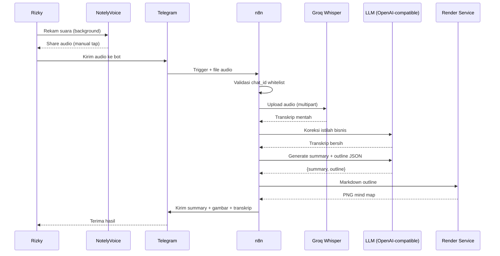
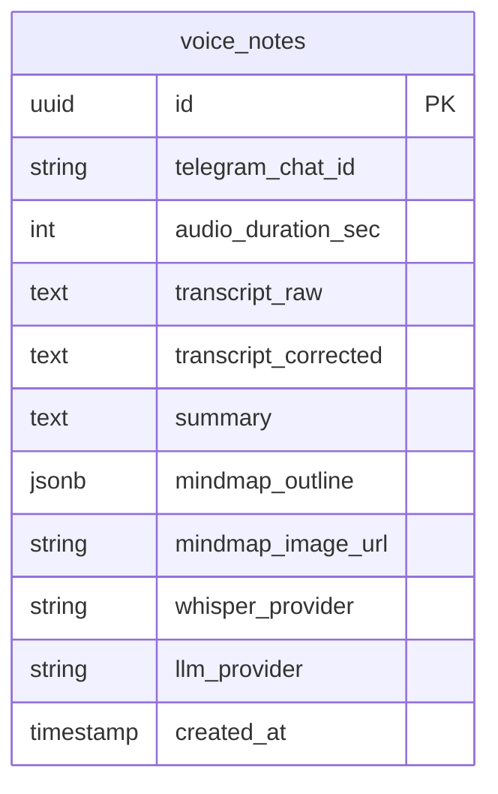

# PRD — Voice-to-Mindmap Pipeline

## 1. Overview

Rizky perlu cara merekam ide/rapat/brainstorm secara background di HP sambil tetap mengerjakan hal lain, lalu otomatis mendapatkan transkrip yang bersih, ringkasan terstruktur, dan mind map visual — tanpa bergantung pada app SaaS berlangganan (Audionotes/Otter) dan tanpa terkunci ke satu provider LLM tertentu. Solusi ini memakai infrastruktur n8n self-hosted yang sudah ada, dengan NotelyVoice (app open source) sebagai perekam suara, Groq Whisper untuk transkripsi berkualitas tinggi dengan biaya rendah, dan LLM ber-endpoint OpenAI-compatible (mudah diganti provider) untuk koreksi istilah bisnis, ringkasan, dan pembuatan outline mind map. Hasil akhir dikirim kembali ke Telegram sebagai teks ringkasan + gambar mind map.

**Kenapa versi ini "terbaik" bukan sekadar termurah:**
- Transkripsi pakai model Whisper Large-v3 penuh (bukan versi kecil on-device) → akurasi jauh lebih baik untuk Bahasa Indonesia campur istilah bisnis.
- Ada lapisan koreksi AI khusus untuk istilah brand (Zaneva, Elyasr, ROAS, dll) sebelum diringkas — mengatasi keluhan "transkrip ngaco".
- Provider LLM & Whisper dibuat sebagai *config*, bukan hardcode — tinggal ganti base_url/api_key/model kapan saja tanpa mengubah struktur workflow.

---

## 2. Requirements

- **Aksesibilitas:** Telegram (bot pribadi, bisa diakses dari HP/desktop di mana saja) + NotelyVoice (app Android/iOS) untuk perekaman
- **Pengguna:** Single user (Rizky) — bot privat, direspons hanya untuk 1 Telegram chat ID (whitelist)
- **Auth:** Telegram Bot Token (BotFather) + validasi `chat_id` terhadap whitelist Rizky di setiap trigger
- **Data Input:** Voice note / file audio yang dikirim manual (tap share) dari NotelyVoice ke Telegram bot
- **Export:** Balasan ke Telegram berupa (1) teks ringkasan terstruktur, (2) gambar mind map (PNG)
- **Constraint khusus:**
  - n8n self-hosted v1.119.2 — semua HTTP call **wajib** lewat HTTP Request node terpisah (Code node tidak punya `fetch`/`$http`)
  - Body yang mengandung input bebas (transkrip) **wajib** disanitasi via `JSON.stringify()` di Code node, dikirim sebagai Raw body ke HTTP Request node — jangan pakai "Specify Body: JSON"
  - Semua kredensial (Groq key, LLM provider key, Telegram token) disimpan sebagai n8n Credentials, bukan hardcode di node

---

## 3. Core Features

### 3.1 Terima audio dari Telegram *(Must-have)*
- Telegram Trigger node menangkap pesan voice note maupun file audio
- Download file audio via Telegram File API
- Validasi `chat_id` terhadap whitelist sebelum lanjut — kalau bukan chat Rizky, workflow berhenti tanpa respons

### 3.2 Transkripsi via Groq Whisper *(Must-have)*
- HTTP Request node → Groq API (`whisper-large-v3`), multipart form-data upload file audio
- Bahasa di-set eksplisit ke Indonesian (bukan auto-detect) untuk akurasi lebih stabil
- Fallback: kalau Groq API gagal/timeout, retry sekali ke OpenAI Whisper sebagai backup provider

### 3.3 Koreksi transkrip berbasis kamus istilah bisnis *(Must-have)*
- LLM call (OpenAI-compatible endpoint) dengan system prompt berisi daftar istilah/brand Rizky (Zaneva, Elyasr, Be.Syari, Oberbe, ROAS, HPP, omzet, dll) sebagai referensi ejaan
- Instruksi: perbaiki typo & istilah, jangan ubah makna atau menambah informasi baru

### 3.4 Generate ringkasan + outline terstruktur *(Must-have)*
- LLM call menghasilkan JSON terstruktur: `{ summary: string, outline: [{ title, children: [...] }] }`
- Outline inilah yang jadi basis mind map (maks 3 level kedalaman supaya render tetap rapi)

### 3.5 Render mind map jadi gambar *(Must-have)*
- Outline JSON dikonversi ke markdown heading (`#`, `##`, `###`)
- Dikirim ke micro-service render (markmap-cli + Puppeteer, self-hosted di VPS Tencent Cloud milik Rizky) → hasil PNG
- Pola ini konsisten dengan Zaneva Storyboard AI yang sudah pernah dibangun (Puppeteer untuk rendering)

### 3.6 Balas ke Telegram *(Must-have)*
- Kirim 2 pesan: teks ringkasan (format rapi, bold judul) + gambar mind map (sendPhoto)
- Sertakan transkrip yang sudah dikoreksi sebagai pesan terpisah (collapsible / kirim sebagai file .txt kalau panjang)

### 3.7 Provider switching via config *(Must-have)*
- `base_url`, `api_key`, `model` untuk LLM disimpan sebagai n8n Credential terpisah, direferensikan lewat 1 HTTP Request node
- Ganti provider (Anthropic/GPT/Gemini/Grok/MiMo) = ganti 3 field ini saja, tidak perlu ubah struktur workflow

### 3.8 Error handling *(Must-have)*
- Setiap tahap (transkripsi, koreksi, summary, render) dibungkus IF/error-check node
- Kalau gagal di tahap manapun, kirim pesan error singkat ke Telegram ("Transkripsi gagal, coba kirim ulang") — jangan silent fail

### 3.9 Logging riwayat *(Nice-to-have — v2)*
- Simpan setiap hasil (transkrip, summary, outline, link gambar) ke PostgreSQL supaya bisa dicari/diakses lagi nanti
- Tidak wajib di MVP, workflow tetap stateless di versi pertama

---

## 4. User Flow

### Flow Utama
1. Rizky merekam suara di NotelyVoice (berjalan di background sambil multitasking)
2. Setelah selesai, Rizky tap **Share** → pilih Telegram → kirim ke bot pribadi
3. n8n Telegram Trigger menangkap pesan, validasi chat_id
4. n8n download file audio, kirim ke Groq Whisper API → dapat transkrip mentah
5. Transkrip mentah dikirim ke LLM untuk koreksi istilah bisnis → transkrip bersih
6. Transkrip bersih dikirim ke LLM (call kedua atau sama) → hasil JSON summary + outline
7. Outline dikonversi ke markdown → dikirim ke render service → hasil PNG mind map
8. n8n balas ke Telegram: ringkasan teks + gambar mind map + transkrip bersih

### Edge Cases
- **Audio terlalu panjang** (>25MB, batas umum Whisper API): split audio jadi beberapa chunk sebelum transkripsi, gabungkan hasilnya
- **Transkrip kosong** (audio hening/noise doang): hentikan pipeline, kirim pesan "Tidak ada suara terdeteksi"
- **LLM mengembalikan JSON tidak valid**: retry 1x dengan prompt "pastikan output JSON valid", kalau tetap gagal kirim summary versi teks biasa tanpa mind map
- **Render service timeout**: kirim summary teks dulu, mind map menyusul setelah retry, atau beri tahu gagal render

---

## 5. Architecture

---

## 6. Database Schema *(Nice-to-have — v2, opsional di MVP)*

| Tabel | Fungsi |
|-------|--------|
| `voice_notes` | Menyimpan riwayat setiap rekaman yang diproses — transkrip, summary, outline, dan link gambar mind map, untuk pencarian/referensi di kemudian hari |

---

## 7. Design & Technical Constraints

### Tech Stack
- **Automation:** n8n self-hosted v1.119.2 (existing infra)
- **Trigger:** Telegram Bot API (native n8n Telegram node) — bukan WAHA, karena target channel-nya Telegram
- **Transkripsi:** Groq API (`whisper-large-v3`), fallback OpenAI Whisper
- **LLM (koreksi + summary + outline):** Endpoint OpenAI-compatible, provider default direkomendasikan Gemini 3.1 Flash-Lite atau GPT-5 Mini (sweet spot biaya vs konsistensi format JSON), mudah diganti ke Anthropic/Grok/MiMo via credential
- **Render mind map:** markmap-cli + Puppeteer, micro-service kecil (Node.js/Express) self-hosted di VPS Tencent Cloud (43.129.38.56), dipanggil via HTTP Request node
- **Database (v2, opsional):** PostgreSQL + Prisma, mengikuti standar existing ELYASR stack
- **Deploy render service:** EasyPanel, konsisten dengan deployment existing

### Naming Convention
- Field/label yang tampil ke Rizky: Bahasa Indonesia
- Nama workflow/node di n8n: Bahasa Inggris, deskriptif (`transcribe-audio`, `correct-terms`, `generate-outline`, `render-mindmap`)
- Environment variable: `UPPER_SNAKE_CASE` (`LLM_BASE_URL`, `LLM_API_KEY`, `LLM_MODEL`, `WHISPER_PROVIDER`)

### Business Logic Hardcoded
- Whitelist `chat_id` Rizky — bot tidak merespons chat lain
- Kamus istilah brand (Zaneva, Elyasr, Be.Syari, Oberbe, Muslimah Swimwear, ROAS, HPP, omzet, dll) sebagai referensi koreksi — perlu di-maintain manual kalau ada brand/istilah baru
- Outline mind map dibatasi maks 3 level kedalaman untuk menjaga hasil render tetap terbaca

### Constraint Lain
- Semua HTTP call ke API eksternal (Groq, LLM, render service, Telegram) lewat HTTP Request node terpisah — tidak ada `fetch` di dalam Code node
- Body request yang mengandung teks transkrip bebas wajib disanitasi via `JSON.stringify()` sebelum dikirim sebagai Raw body
- Kredensial provider (Groq, LLM, Telegram) disimpan di n8n Credentials, tidak hardcode di node manapun — ini yang membuat "ganti LLM" semudah ganti 1 credential

---

## Checklist Sebelum Present PRD

- [x] Disimpan sebagai file `.md`
- [x] Nama file: `PRD-voice-to-mindmap.md`
- [x] Overview menjelaskan masalah dan tujuan dengan jelas
- [x] Requirements mencakup aksesibilitas, pengguna, auth, constraint
- [x] Semua core feature terdaftar dan diprioritaskan (Must-have vs Nice-to-have)
- [x] User flow mencakup happy path dan edge case utama
- [x] Architecture diagram menggambarkan aliran data end-to-end
- [x] DB schema opsional disertakan untuk v2
- [x] Tech stack ditentukan sesuai ekosistem n8n existing Rizky
- [x] Business logic hardcoded tercatat eksplisit
- [x] Provider LLM & Whisper dibuat sebagai config, bukan hardcode
