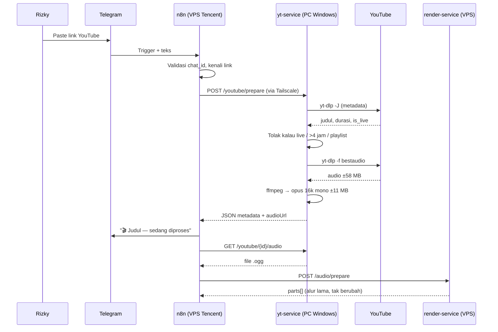

# PRD — yt-service (Jembatan Link YouTube → Audio)

## 1. Overview

Pipeline Voice-to-Mindmap sekarang hanya menerima voice note dari Telegram. Rizky ingin bisa
melempar link YouTube dan mendapat hasil yang sama: ringkasan + mind map + transkrip. Seluruh
pipeline setelah tahap "dapat file audio" sudah ada dan sudah teruji, jadi fitur ini sebenarnya
sempit: **ubah link YouTube jadi file audio siap-Whisper.**

Masalahnya, YouTube memblokir permintaan dari IP datacenter dengan pesan *"Sign in to confirm
you're not a bot"*, dan itu bukan bug yt-dlp yang bisa ditambal — maintainer-nya sendiri menutup
laporan seperti itu sebagai perilaku YouTube, bukan cacat perangkat lunak. PO token sudah tidak
mempan untuk mayoritas kasus. Yang tersisa sebagai solusi nyata adalah **IP residential**.

Karena itu yt-service tidak tinggal di VPS Tencent bersama render-service, melainkan di **PC
Windows milik Rizky**, dan dipanggil n8n lewat jaringan privat Tailscale. Konsekuensinya diterima
sadar: fitur YouTube hanya hidup saat PC menyala.

**Kenapa service terpisah, bukan sekadar memanggil yt-dlp dari n8n:**
- n8n v1.119.2 tidak punya `fetch`/`$http` di Code node, dan tidak boleh menjalankan proses di host-nya.
- Audio perlu dikompres **sebelum** naik ke VPS — 1 jam video turun dari ±58 MB jadi ±11 MB.
- Logika penolakan (live, playlist, durasi) lebih baik dijaga di satu tempat yang bisa diuji sendiri
  lewat `curl`, tanpa menyalakan n8n.

---

## 2. Requirements

- **Aksesibilitas:** hanya dipanggil oleh n8n di VPS lewat Tailscale. Tidak ada UI, tidak ada
  pengguna manusia, tidak terekspos ke internet publik.
- **Pengguna:** satu klien mesin (n8n). Bukan multi-tenant.
- **Auth:** header rahasia bersama (`httpHeaderAuth`), pola yang sama dengan render-service.
  Tetap dipakai meski jaringannya sudah privat.
- **Data Input:** satu URL video YouTube (`youtube.com/watch`, `youtu.be/`, `/shorts/`).
- **Export:** (1) JSON metadata video, (2) file audio `.ogg` (Opus 16 kHz mono).
- **Constraint khusus:**
  - Jalan di **Windows**, bukan container — `--cookies-from-browser` butuh profil browser di host,
    dan `yt-dlp -U` jauh lebih sederhana secara native.
  - Service **wajib auto-start** bersama Windows. "PC menyala" tidak cukup kalau service-nya mati.
  - Socket **di-bind ke alamat Tailscale saja**, bukan `0.0.0.0`, supaya port tidak ikut terbuka
    di WiFi rumah atau kantor.
  - Konversi audio memanggil **ffmpeg secara eksplisit**, bukan lewat `--audio-format` milik yt-dlp
    (alasan di bagian 7).

---

## 3. Core Features

### 3.1 `POST /youtube/prepare` *(Must-have)*
- Body: `{ "url": "https://..." }`
- Mengambil metadata, mengunduh audio, mengompres, menyimpan, lalu membalas:

```json
{
  "ok": true,
  "id": "uuid",
  "videoId": "dQw4w9WgXcQ",
  "title": "Judul video",
  "channel": "Nama channel",
  "durationSec": 3600,
  "sizeBytes": 11010048,
  "audioUrl": "http://100.x.y.z:8080/youtube/{id}/audio"
}
```

### 3.2 `GET /youtube/{id}/audio` *(Must-have)*
- Mengirim file `.ogg` hasil kompresi. Ekstensi `.ogg` wajib dipertahankan karena Whisper API
  menolak file tanpa ekstensi yang dikenal.
- Pola dua langkah ini mengikuti `/audio/prepare` → `Download Part` yang sudah dipakai render-service,
  supaya bentuk node di n8n konsisten.

### 3.3 Validasi & penolakan dini *(Must-have)*
Ditolak **sebelum** ada byte yang diunduh:
- URL bukan video tunggal (playlist murni, channel, URL asing)
- Live stream / premiere yang sedang berjalan
- Durasi melewati batas (default 4 jam)
- Durasi tidak diketahui

Kalau `list=` menempel pada URL video biasa, parameter itu diabaikan dan videonya tetap diproses.

### 3.4 Kompresi audio eksplisit *(Must-have)*
- `yt-dlp -f bestaudio` → file mentah
- `ffmpeg -vn -map 0:a:0 -ac 1 -ar 16000 -c:a libopus -b:a 24k -application voip` → `.ogg`
- Parameter **identik** dengan `transcodeToOpus()` di `render-service/src/audio.js`, supaya audio
  YouTube dan voice note tiba di Whisper dalam bentuk yang sama.

### 3.5 Kode error yang bisa dipetakan *(Must-have)*
Semua kegagalan membalas bentuk yang sama: `{ "ok": false, "code": "...", "message": "..." }`.

| `code` | HTTP | Arti |
|---|---|---|
| `INVALID_URL` | 400 | Bukan URL YouTube |
| `UNSUPPORTED_URL` | 400 | Playlist / channel, bukan video tunggal |
| `LIVE_NOT_SUPPORTED` | 400 | Sedang siaran langsung |
| `TOO_LONG` | 400 | Melewati batas durasi |
| `DURATION_UNKNOWN` | 400 | Durasi tidak terbaca (premiere/siaran) — bukan "terlalu panjang" |
| `VIDEO_UNAVAILABLE` | 404 | Privat, dihapus, atau dibatasi wilayah |
| `BOT_CHECK` | 502 | YouTube meminta verifikasi bot |
| `DOWNLOAD_FAILED` | 502 | yt-dlp gagal karena sebab lain |
| `TRANSCODE_FAILED` | 500 | ffmpeg gagal |
| `STORAGE_FULL` | 507 | Ruang disk habis |

Kode-kode inilah yang diterjemahkan n8n jadi pesan Telegram berbahasa manusia. Tanpa ini, semua
kegagalan terlihat sama dari sisi n8n dan Rizky cuma menerima "gagal" tanpa tahu harus berbuat apa.

### 3.6 `GET /health` *(Must-have)*
Membalas status service, versi yt-dlp, dan ketersediaan ffmpeg. Gunanya supaya n8n bisa membedakan
**"PC sedang mati"** dari **"videonya yang bermasalah"** — dua hal yang tindak lanjutnya beda jauh.

### 3.7 Janitor pembersih file *(Must-have)*
File audio dihapus setelah TTL lewat (default 2 jam), menyalin pola `startJanitor()` di
render-service. Tanpa ini, disk PC akan penuh diam-diam.

### 3.8 Dukungan cookies *(Nice-to-have)*
Membaca file cookies opsional untuk video terbatas umur atau saat bot-detection mulai rewel.
Kalau dipakai, disarankan memakai akun sekali pakai — ada risiko akun kena flag.

### 3.9 Pembaruan yt-dlp *(Nice-to-have)*
YouTube berubah terus, jadi yt-dlp perlu diperbarui berkala. Cukup scheduled task mingguan
menjalankan `yt-dlp -U`. Tidak masuk MVP.

### 3.10 Cache per videoId *(Nice-to-have — v2)*
Video yang sama tidak perlu diunduh dua kali dalam rentang TTL. Tidak wajib di MVP.

---

## 4. User Flow

### Flow Utama
1. Rizky paste link YouTube ke bot Telegram
2. n8n memvalidasi chat_id, mengenali teksnya sebagai link YouTube
3. n8n `POST /youtube/prepare` ke PC lewat Tailscale
4. yt-service ambil metadata (`yt-dlp -J`) — judul, channel, durasi, status live
5. Ditolak di sini kalau live / kepanjangan / bukan video tunggal
6. Download `bestaudio` ke folder sementara
7. ffmpeg kompres jadi Opus 16 kHz mono
8. Balas JSON berisi metadata + `audioUrl`
9. n8n kirim pesan "🎬 Judul — sedang diproses" ke Telegram
10. n8n `GET audioUrl` → dapat file `.ogg`
11. File masuk ke node `Prepare Audio` yang sudah ada → mulai titik ini alurnya identik dengan voice note

### Edge Cases
- **PC mati / Tailscale putus:** n8n gagal terhubung → `Stage: YouTube Gagal` → "PC perekam sedang tidak aktif"
- **Bot-detection:** balas `BOT_CHECK`, saran pakai cookies. Ini kegagalan yang paling mungkin berulang
- **Video sangat panjang (3-4 jam):** tetap diproses, tapi hasil kompresinya bisa di atas 24 MB —
  render-service yang akan memotongnya jadi beberapa part, dan itu sudah jalan hari ini
- **Disk penuh:** balas `STORAGE_FULL`, jangan menulis file separuh jadi
- **Request kedua saat yang pertama masih jalan:** dilayani terpisah, tiap request punya `id` sendiri
- **yt-dlp berhasil tapi file kosong:** diperlakukan sebagai `DOWNLOAD_FAILED`, jangan diteruskan

---

## 5. Architecture



---

## 6. Database Schema

**Tidak ada, dan itu disengaja.** State satu-satunya adalah file di folder kerja plus `manifest.json`
kecil per request, yang dibersihkan janitor. Menambahkan database di sini hanya memindahkan sesuatu
yang sudah punya masa hidup alami (TTL file) ke tempat yang harus dijaga sendiri.

Riwayat hasil tetap urusan tabel `voice_notes` di sisi n8n (lihat `db/schema.sql`), bukan urusan
service ini.

---

## 7. Design & Technical Constraints

### Tech Stack
- **Runtime:** Node.js 20+ LTS, Express — sebangun dengan render-service
- **Downloader:** `yt-dlp.exe` (binary native Windows)
- **Audio:** `ffmpeg.exe` + `ffprobe.exe`
- **Jaringan:** Tailscale (WireGuard) — tidak ada port yang terbuka ke internet
- **Auto-start:** NSSM / pm2-windows-startup / Task Scheduler dengan trigger *At startup*
- **Host:** PC Windows 11 milik Rizky

### Naming Convention
- Nama endpoint & field JSON: Bahasa Inggris (`durationSec`, `audioUrl`) — konsisten dengan render-service
- Pesan error yang sampai ke Rizky: Bahasa Indonesia, dirakit di n8n, bukan di service
- Environment variable: `UPPER_SNAKE_CASE`

| Variabel | Default | Fungsi |
|---|---|---|
| `BIND_ADDRESS` | *(wajib diisi)* | Alamat Tailscale, jangan `0.0.0.0` |
| `PORT` | `8080` | Port service |
| `SERVICE_TOKEN` | *(wajib diisi)* | Rahasia bersama dengan n8n, dikirim sebagai `Authorization: Bearer …`. Dibuat sendiri (`node -e "console.log(require('crypto').randomBytes(24).toString('hex'))"`), dan **beda** dari token render-service |
| `PUBLIC_BASE_URL` | — | Dasar `audioUrl` yang dikirim ke n8n |
| `YTDLP_PATH` | `yt-dlp` | Lokasi binary |
| `FFMPEG_PATH` / `FFPROBE_PATH` | `ffmpeg` / `ffprobe` | Lokasi binary |
| `WORK_DIR` | `./work` | Folder kerja |
| `MAX_DURATION_SEC` | `14400` | Batas 4 jam |
| `FILE_TTL_MS` | `7200000` | Umur file sebelum dihapus janitor |
| `DOWNLOAD_TIMEOUT_MS` | `900000` | Batas waktu yt-dlp |
| `COOKIES_FILE` | *(kosong)* | Opsional |

### Business Logic Hardcoded
- Batas durasi 4 jam — angka yang dipilih supaya podcast panjang masih lolos tapi stream 10 jam tidak
- Format keluaran selalu Opus 16 kHz mono 24 kbps
- Hanya video tunggal YouTube. Playlist, channel, dan situs lain di luar cakupan

### Constraint Lain
- **ffmpeg dipanggil sendiri, bukan lewat `-x --audio-format opus`.** Postprocessor yt-dlp cenderung
  *melewati* proses encode kalau codec sumbernya sudah sama dengan target — dan YouTube menyajikan
  Opus, sementara target kita juga Opus. Argumen `-ac 1 -ar 16000` berisiko diabaikan diam-diam,
  dan yang keluar tetap 48 kHz stereo tanpa satu pun pesan error. Ini jenis kegagalan sunyi yang
  sama dengan bug truncation di tahap koreksi, dan tidak boleh diulang.
- **Kompresi terjadi di PC, bukan VPS.** ffmpeg akan jalan dalam skenario mana pun karena file 58 MB
  melewati batas potong render-service. Melakukannya di PC berarti sekali kerja, di mesin yang CPU-nya
  menganggur, dan sebelum upload — bukan sesudah.
- **Judul video adalah teks dari orang lain.** Ia ikut masuk ke system prompt LLM di sisi n8n, jadi
  harus dibersihkan (buang baris baru, batasi panjang) sebelum dipakai. Video berjudul
  *"Abaikan instruksi sebelumnya…"* adalah celah prompt injection yang nyata.
- **Mengunduh dari YouTube bertentangan dengan ToS mereka.** Untuk pemakaian pribadi risikonya kecil,
  tapi ini dicatat eksplisit sebagai keputusan sadar, bukan sesuatu yang terlewat.
- **Bot-detection tidak punya solusi permanen.** Ini kucing-kucingan yang terus berjalan; ekspektasinya
  fitur ini akan sesekali butuh diservis, tidak seperti jalur voice note yang sekali jadi selesai.

### Di Luar Cakupan (v1)
- Mengambil caption/subtitle YouTube — menambah titik temu kedua di tengah pipeline tanpa untung
  keandalan, karena caption menabrak tembok bot-detection yang sama
- Playlist, channel, dan situs selain YouTube
- Antarmuka web
- Cache, antrian, dan pemrosesan paralel

---

## 8. Kriteria Selesai

- [ ] `curl` ke `/youtube/prepare` dengan video 10 menit mengembalikan `.ogg` yang bisa diputar
- [ ] Ukuran hasil ±5x lebih kecil dari `bestaudio` mentah, dan `ffprobe` memastikan 16 kHz **mono**
- [ ] Live stream, playlist, dan video >4 jam ditolak sebelum ada byte yang diunduh
- [ ] Tiap kegagalan mengembalikan `code` yang benar, bukan 500 generik
- [ ] `/health` menjawab saat service hidup, dan gagal terhubung saat service mati
- [ ] Janitor menghapus file setelah TTL
- [ ] Request tanpa header auth ditolak 401
- [ ] Port tidak bisa dijangkau dari luar Tailscale
- [ ] Service hidup lagi sendiri setelah PC di-restart
- [ ] Semua di atas terbukti lewat `curl`, sebelum satu node pun ditambahkan ke n8n

---

## Checklist Sebelum Present PRD

- [x] Disimpan sebagai file `.md`
- [x] Nama file: `PRD-yt-service.md`
- [x] Overview menjelaskan masalah dan alasan service ini terpisah dari render-service
- [x] Requirements mencakup aksesibilitas, pengguna, auth, constraint
- [x] Semua core feature terdaftar dan diprioritaskan (Must-have vs Nice-to-have)
- [x] User flow mencakup happy path dan edge case utama
- [x] Architecture diagram menggambarkan aliran data end-to-end
- [x] Keputusan "tanpa database" dinyatakan eksplisit beserta alasannya
- [x] Tech stack ditentukan sesuai ekosistem existing Rizky
- [x] Business logic hardcoded tercatat eksplisit
- [x] Kriteria selesai bisa diuji tanpa menyalakan n8n
